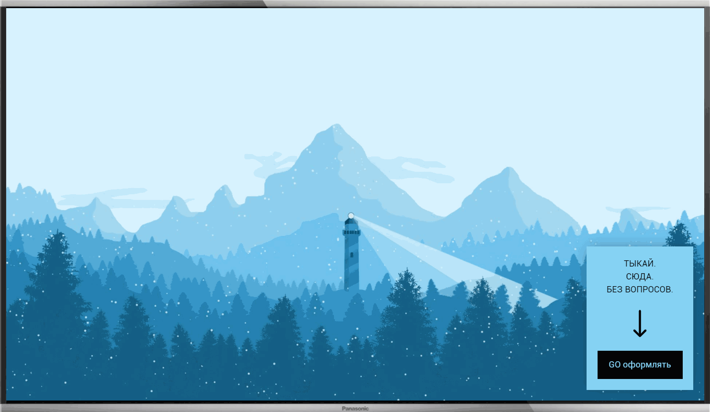
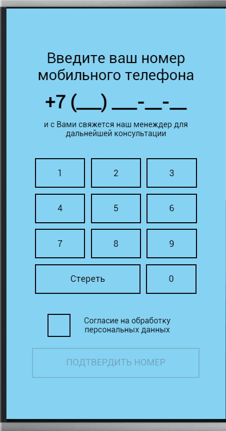

# react-SmartTV

**SmartTV app** - app for applications for the purchase of goods on TVs.

## Running application
___
https://dmitriev-nikolay.github.io/react-SmartTV/

## Application information
___
+ the application is created only for resolution 1280x720
+ the app is built with create-react-app
+ functional components used
+ for styles used scss
+ for the convenience of working with entering a phone number, the ___**react-number-format**___ library is used

## Installation
___
+ clone this repository to your computer
+ open a project in IDE
+ and:

```javascript
npm install
```

## Usage
___
```javascript
npm start
```

## Functional
___
### Home banner

>3 seconds after opening the application, a banner appears for placing an order.


### Go to order

>By clicking on the banner, you go to the order.



### Personal data checkbox

>To activate the button to place an order, you must agree to the processing of personal data.



### Phone number input

>To enter a phone number, an on-screen keyboard is provided with the ability to delete numbers.


### Phone number input

>If the phone number is incorrect, the form is not sent and a hint appears with information on recommendations for entering the number.


### Send form

>If you enter the phone number correctly and agree to the processing of personal data, the form is sent and a window is displayed with information about the successful sending. There is a button to close the form and return to the initial screen.

